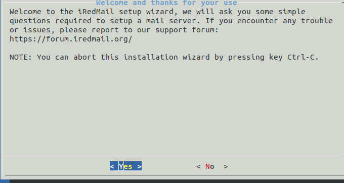
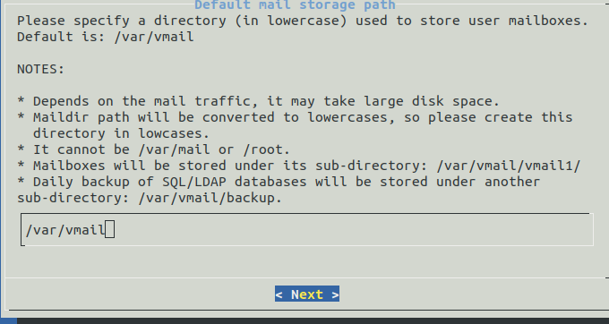
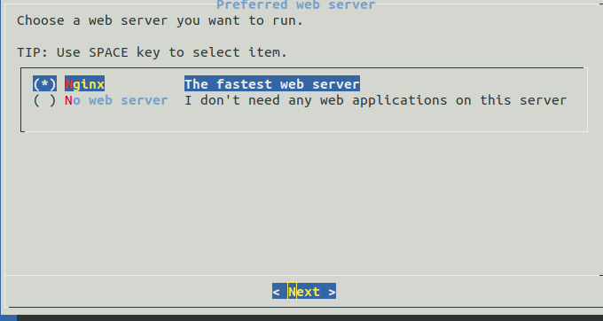
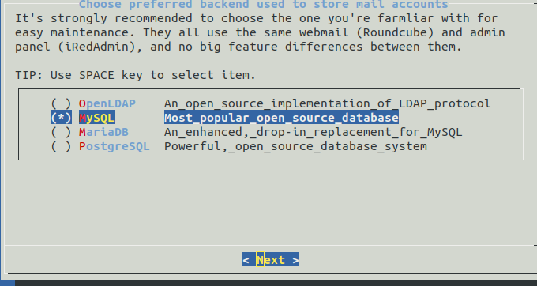
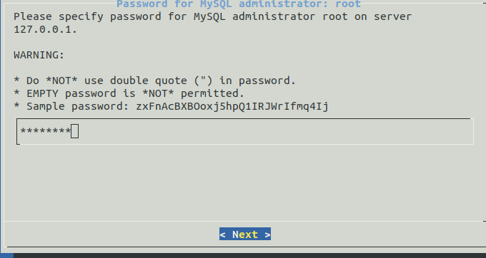
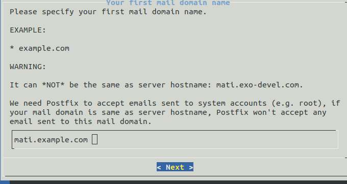
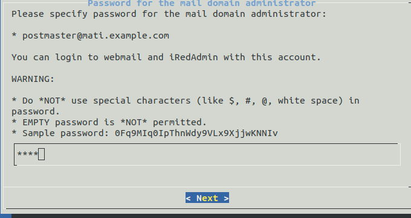
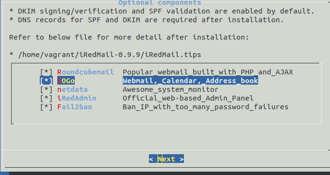
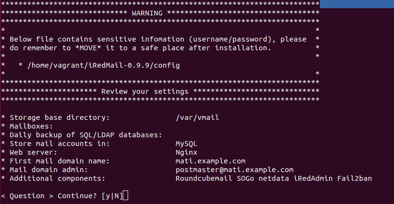

## iRedMail

iRedMail is an application to manage mail servers, so that the software facilitates all the configurations to work with our mail server. Collect a large number of applications to manage email accounts.

All components used in iRedMail are open source softwares, and you get the bug fixes and updates from the Linux/BSD venders you trust. iRedMail is the right way to build your mail server with open source softwares.

Works on Red Hat, CentOS, Debian, Ubuntu, FreeBSD, OpenBSD.  

**List Software of iRedMail:**

    Postfix: Mail transfer agent , MTA.
    Dovecot: Server POP3 e IMAP.
    Nginx: Web server.
    OpenLDAP: Server to save mail accounts.
    MySQL, MariaDB, PostgreSQL: Database.
    SpamAssassin: Anti-spam.
    ClamAV: AntiVirus.
    Amavisd-new: Interface of manage.
    Roundcube: Email client for web.
    SOGo Groupware: Client to manage calendar, contacts, etc.
    Fail2ban: To block access attempts by brute force.
    NetData: Monitor on real-time.

**Necesary requisites:**

    Any Linux distribution
    Min RAM 2GB

### Preparations

    /etc/hostname
    mx

    /etc/hosts
    127.0.0.1       localhost
    127.0.1.1       mx.exo-devel.com mx vagrant.vm mx.mati.exo-devel.com
    192.168.56.102 mati.exo-devel.com

    sudo apt update
    sudo apt install bzip2
    wget https://bitbucket.org/zhb/iredmail/downloads/iRedMail-0.9.9.tar.bz2
    tar xjf iRedMail-0.9.9.tar.bz2

    cd iRedMail-0.9.9
    sudo su
    bash iRedMail.sh

### Installation

Required to setup a mail server: Yes

Default mail storage path: /var/vmail

Prefered web server: Nginx

Choose prefered backend used to store mail accounts: MySQL

Password for MySQL: xxxxx

Your first mail domain name: mati.example.com

Password for the mail domain administrator: xxxx

Optional components: All

Review your settings: y

### Access web applications

    Roundcube webmail: https://192.168.56.102/mail or https://your_server/mail/
    SOGo groupware: https://192.168.56.102/SOGo or https://your_server/SOGo
    Netdata (monitor): https://192.168.56.102/netdata or httpS://your_server/netdata
    Web admin panel (iRedAdmin): https://192.168.56.102/iredadmin or httpS://your_server/iredadmin/

    user:postmaster@mati.example.com
    password:xxxx

### Installation automate

We are going to mount a mail server with iRedMail in a virtual machine, then we will automate the installation.

To automate the installation of the software, we will use vagrant and ansible.

Vagrant is a tool that helps us create and manage virtual machines with the same work environment.

Ansible is a very simple orchestration engine that automates all kinds of tasks necessary for the provisioning of our machine.

**To run the automation**

      vagrant up

we need the files: Vagrantfile, playbook.yml and config.j2, download or copy this files.

Necesary requisites:
  Install vagrant with "sudo apt install vagrant"
  Install ansible with "sudo apt install ansible"
  To have python2 or python3

NOTE: if you can't view the service in your browser, to have "vagrant halt" and "vagrant up".

